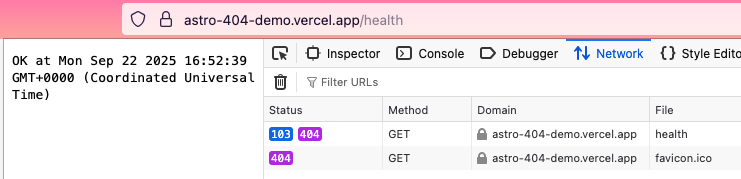

# Astro Middleware 404 Bug Demo

This application demonstrates an issue with the Vercel adapter when using Astro middleware.

To reproduce:

1. create a [custom 404 page](./src/pages/404.astro)
2. create a [middleware](./src/middleware/index.ts) that returns a 2xx response for a path that does not exist in [src/pages/](./src/pages/)
3. deploy to Vercel

## Evidence

### Local

On any branch (`main`, `netlify`, or `vercel`), run `pnpm dev`.

A page that exists **correctly** returns a 200 with the correct content and a debug header added by the middleware:

```
curl -sv http://localhost:4321/
...
< HTTP/1.1 200 OK
...
< astro-debug: res.status=200
...
<title>Astro</title>
```

A page that doesn't exist **correctly** returns a 404 with the correct Not Found content and a debug header:

```
curl -sv http://localhost:4321/does-not-exist
...
< HTTP/1.1 404 Not Found
...
< astro-debug: res.status=404
...
<title>Astro: Not Found</title>
```

A resource that is handled by the middleware **correctly** returns a 200 with the correct content:

```
curl -sv http://localhost:4321/health
...
OK at Mon Sep 22 2025 09:33:20 GMT-0700 (Pacific Daylight Time)
```

### Netlify

The `netlify` branch is deployed to `astro-404-demo.netlify.app`. It exhibits the same behavior as local development:

```
# some content elided for clarity
curl -sv https://astro-404-demo.netlify.app/
< HTTP/2 200
< astro-debug: res.status=200
<title>Astro</title>

curl -sv https://astro-404-demo.netlify.app/does-not-exist
< HTTP/2 404
< astro-debug: res.status=404
<title>Astro: Not Found</title>

curl -sv https://astro-404-demo.netlify.app/health
< HTTP/2 200
OK at Mon Sep 22 2025 16:35:47 GMT+0000 (Coordinated Universal Time)
```

### Vercel

The `vercel` branch is deployed to `astro-404-demo.vercel.app`.

A page that exists **correctly** returns a 200 with the correct content and a debug header from the middleware:

```
curl -sv https://astro-404-demo.vercel.app/
< HTTP/2 200
< astro-debug: res.status=200
<title>Astro</title>
```

A page that does not exist **correctly** returns a 404 with the correct content and a debug header from the middleware:

```
curl -sv https://astro-404-demo.vercel.app/does-not-exist
< HTTP/2 404
< astro-debug: res.status=404
<title>Astro: Not Found</title>
```

A resource that is handled by the middleware **should** return a 200 with the correct body. Instead, it returns a 404 (or, more precisely, a 103 Early Hints followed by a 404 Not Found) with the correct body:

```
curl -sv https://astro-404-demo.vercel.app/health
< HTTP/2 404
OK at Mon Sep 22 2025 16:52:02 GMT+0000 (Coordinated Universal Time)
```


